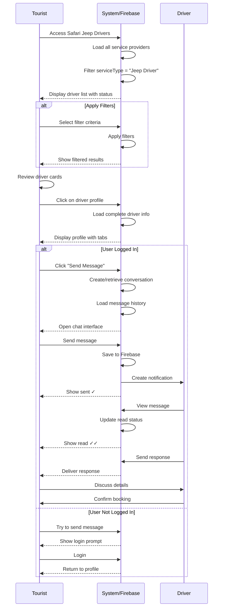

# Find Jeep Driver - Activity Diagram (Mermaid)

This is a simplified activity diagram in Mermaid format that can be rendered directly in GitHub.

```mermaid
flowchart TD
    Start([Tourist Starts]) --> Access[Access SafariHub Platform]
    Access --> Navigate[Navigate to Safari Jeep Drivers]
    Navigate --> LoadDrivers[System: Load Jeep Drivers from Firebase]
    LoadDrivers --> FilterDrivers[System: Filter serviceType = 'Jeep Driver']
    FilterDrivers --> DisplayList[System: Display Driver List with Status]
    
    DisplayList --> ApplyFilters{Want to Apply Filters?}
    ApplyFilters -->|Yes| SelectFilters[Select Filter Criteria:<br/>- Destination<br/>- Rating<br/>- Price Range<br/>- Vehicle Type<br/>- Languages<br/>- Skills]
    SelectFilters --> SystemFilter[System: Apply Filters]
    SystemFilter --> UpdateList[System: Update Driver List]
    UpdateList --> CheckResults{Results Found?}
    
    CheckResults -->|No| NoResults[Show 'No Drivers Found']
    NoResults --> ClearChoice{Clear Filters?}
    ClearChoice -->|Yes| ClearFilters[System: Reset Filters]
    ClearFilters --> DisplayList
    ClearChoice -->|No| AdjustFilters[Adjust Criteria]
    AdjustFilters --> SelectFilters
    
    CheckResults -->|Yes| ViewList[View Filtered List]
    ApplyFilters -->|No| ViewAll[Browse All Drivers]
    ViewList --> ReviewCards[Review Driver Cards]
    ViewAll --> ReviewCards
    
    ReviewCards --> FoundDriver{Found Suitable Driver?}
    FoundDriver -->|No| TryAgain{Try Again?}
    TryAgain -->|Yes| DisplayList
    TryAgain -->|No| Exit([Exit])
    
    FoundDriver -->|Yes| ViewProfile{View Full Profile?}
    ViewProfile -->|No| QuickContact[Quick Phone Contact]
    QuickContact --> PhoneCall[Open WhatsApp/Phone]
    PhoneCall --> Exit
    
    ViewProfile -->|Yes| ClickCard[Click Driver Card]
    ClickCard --> Navigate2[System: Navigate to Profile]
    Navigate2 --> LoadProfile[System: Load Complete Info]
    LoadProfile --> ShowTabs[System: Display Tabs:<br/>- Overview<br/>- Services & Rates<br/>- Messages]
    
    ShowTabs --> ReviewDetails[Review Detailed Profile:<br/>- Experience<br/>- Certifications<br/>- Languages<br/>- Destinations<br/>- Skills<br/>- Pricing]
    
    ReviewDetails --> LoggedIn{User Logged In?}
    LoggedIn -->|No| LoginPrompt[Show Login Prompt]
    LoginPrompt --> WantLogin{Want to Login?}
    WantLogin -->|Yes| Login[Redirect to Login]
    Login --> Auth[Complete Authentication]
    Auth --> ReturnProfile[Return to Profile]
    ReturnProfile --> ContactDriver
    WantLogin -->|No| NoteInfo[Note Driver Info]
    NoteInfo --> Exit
    
    LoggedIn -->|Yes| ContactDriver{Want to Contact?}
    ContactDriver -->|No| ContinueBrowse[Continue Browsing]
    ContinueBrowse --> Exit
    
    ContactDriver -->|Yes| ContactMethod{Contact Method?}
    ContactMethod -->|Chat| OpenChat[Click Send Message]
    OpenChat --> CreateConvo[System: Create/Retrieve Conversation]
    CreateConvo --> LoadMessages[System: Load Message History]
    LoadMessages --> EnableSync[System: Enable Real-time Sync]
    EnableSync --> TypeMessage[Type and Send Message]
    TypeMessage --> SaveMessage[System: Save to Firebase]
    SaveMessage --> CreateNotif[System: Create Notification]
    CreateNotif --> UpdateConvo[System: Update Conversation]
    UpdateConvo --> MarkSent[System: Mark as Sent ✓]
    
    MarkSent --> DriverReceives[Driver: Receives Notification]
    DriverReceives --> DriverViews[Driver: Views Message]
    DriverViews --> MarkRead[System: Update Read Status ✓✓]
    MarkRead --> DriverResponds[Driver: Responds]
    DriverResponds --> Discuss[Discuss Safari Details]
    
    ContactMethod -->|Phone| ClickPhone[Click Phone Button]
    ClickPhone --> OpenPhone[System: Open WhatsApp/Dialer]
    OpenPhone --> MakeCall[Make Phone Call]
    MakeCall --> Discuss
    
    Discuss --> Negotiate[Negotiate Terms]
    Negotiate --> Confirm[Confirm Booking]
    Confirm --> Complete([Booking Complete])
    
    style Start fill:#90EE90
    style Complete fill:#90EE90
    style Exit fill:#FFB6C1
    style LoadDrivers fill:#ADD8E6
    style FilterDrivers fill:#ADD8E6
    style DisplayList fill:#ADD8E6
    style SystemFilter fill:#ADD8E6
    style UpdateList fill:#ADD8E6
    style Navigate2 fill:#ADD8E6
    style LoadProfile fill:#ADD8E6
    style ShowTabs fill:#ADD8E6
    style CreateConvo fill:#ADD8E6
    style LoadMessages fill:#ADD8E6
    style EnableSync fill:#ADD8E6
    style SaveMessage fill:#ADD8E6
    style CreateNotif fill:#ADD8E6
    style UpdateConvo fill:#ADD8E6
    style MarkSent fill:#ADD8E6
    style MarkRead fill:#ADD8E6
    style OpenPhone fill:#ADD8E6
    style ClearFilters fill:#ADD8E6
```

## Swimlane Diagram (Simplified)

## Key Features Illustrated

### Real-time Updates
- Online/offline status (live WebSocket updates)
- Message delivery and read receipts
- Instant notifications
- Dynamic filter results

### Decision Points
1. **Apply Filters?** - Tourist can filter or browse all
2. **Results Found?** - System validates filter results
3. **View Profile?** - Quick contact or detailed view
4. **Logged In?** - Authentication check for chat
5. **Contact Method?** - Chat or phone/WhatsApp

### System Actions
- Load and filter drivers from Firebase
- Real-time status monitoring
- Message synchronization
- Notification delivery
- Conversation management

### User Flows
- **Browse Flow**: Access → Filter → Review → Contact
- **Quick Contact**: Access → Browse → Call
- **Detailed Flow**: Access → Filter → Profile → Chat → Book
